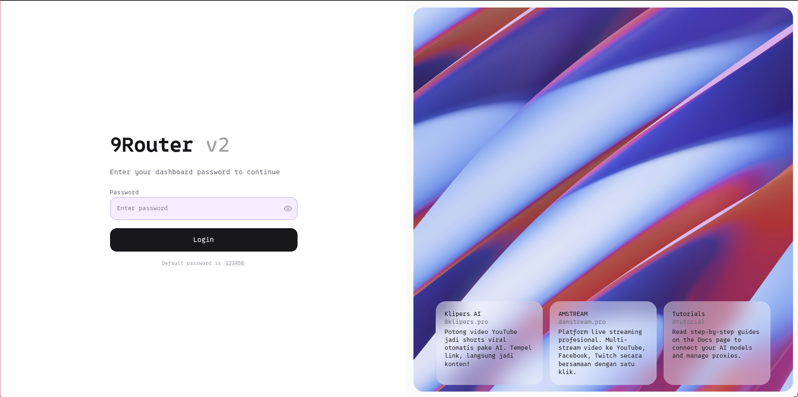
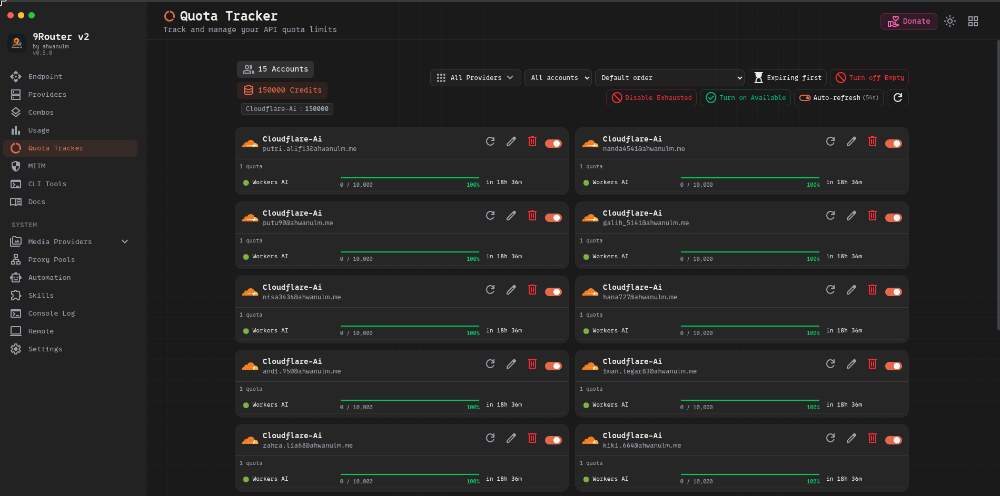

# 9Router v2

> A self-hosted AI gateway — one endpoint, many providers, auto-fallback.

9Router v2 is a decoupled rewrite of [9Router](https://github.com/decolua/9router) with a clean separation between a dedicated **Express backend** and a **Vite + React frontend**. It exposes an OpenAI-compatible REST API that proxies requests across dozens of AI providers with automatic load balancing, fallback, and key rotation.

---

## Screenshots

| Login Page | Quota Tracker |
|:---:|:---:|
|  |  |

---

## Features

- **OpenAI-compatible API** — works with any client that supports `/v1/chat/completions`, `/v1/images/generations`, `/v1/audio/speech`, `/v1/embeddings`, etc.
- **Multi-provider routing** — Cloudflare Workers AI, OpenAI, Anthropic, Gemini, Groq, and many more
- **Cloudflare Workers AI Automation** — automates account registration and API key extraction with Playwright + 2Captcha + Ammail temp mail
- **Dashboard UI** — manage providers, connections, proxy pools, CLI tools, and automation from a modern dark-mode interface
- **OIDC / Password authentication** — single sign-on or local credentials
- **Agent Skills** — ready-to-use SKILL.md files for Claude, Gemini, Codex, and other AI coding agents
- **SQLite backend** — zero-dependency local database, no external services required

---

## Architecture

```
9router-v2/
├── backend/          # Express server (port 3001)
│   └── src/
│       ├── routes/   # Auto-routed endpoints (/v1, /api, /auth, ...)
│       ├── db/       # SQLite via better-sqlite3
│       └── automation/ # Playwright automation scripts
├── frontend/         # Vite + React SPA (port 5177)
│   └── src/
│       ├── pages/    # Dashboard pages
│       └── shared/   # Components, hooks, constants
└── skills/           # Agent SKILL.md files
```

---

## Quick Start

### Requirements

- Node.js 20+
- Python 3.10+ (for automation features)
- Chromium (for Playwright automation)

### Install

```bash
git clone https://github.com/ahwanulm/9router-v2.git
cd 9router-v2
npm install
```

### Development

```bash
npm run dev          # Start both backend + frontend concurrently
npm run backend      # Backend only (port 3001)
npm run frontend     # Frontend only (port 5177)
```

### Environment Variables

Copy and configure the backend environment:

```bash
cp backend/.env.template backend/.env
```

Key variables:

| Variable | Description |
|---|---|
| `PORT` | Backend server port (default: `3001`) |
| `REQUIRE_LOGIN` | Enable authentication (`true`/`false`) |
| `JWT_SECRET` | Secret for JWT signing |
| `ADMIN_PASSWORD` | Dashboard admin password |

---

## Production Deployment

### 1. Build Frontend

```bash
cd frontend && npm run build
```

### 2. Start Backend

```bash
cd backend && npm start
```

### 3. Nginx Reverse Proxy

Use the included `nginx.conf` to proxy `/api` and `/v1` to the backend while serving the built frontend statically. See `docs/deployment-linux.md` for a full Linux deployment guide.

---

## Cloudflare Workers AI Automation

The automation module automatically registers Cloudflare Workers AI accounts:

1. Configure **Ammail** temp mail credentials in Dashboard → Automation → Settings
2. Add a **2Captcha** API key for Turnstile solving
3. Add email accounts in the Automation tab and click **Run**
4. API keys are extracted and added to 9Router automatically

---

## Agent Skills

Skills are SKILL.md files for AI coding agents. Paste the entry skill URL into your AI:

```
Read this skill and use it:
https://raw.githubusercontent.com/ahwanulm/9router-v2/refs/heads/master/skills/9router/SKILL.md
```

Browse all skills in the Dashboard → Skills page or in the [`skills/`](./skills/) directory.

---

## Custom Changes

This version contains local patches for the VPS deployment, maintained by Nareida. The following changes were made on top of the 9Router v2 source and are backed up to this public snapshot.

### User tiers and quota billing

A tier system where an API key belongs to a tier, and the tier sets the cost
ratio and rate limit while the key carries the balance that gets charged.

- **`userGroups`** gains `maxKeys`. `min` and `max` are a consumption window
  measured against `apiKeys.lifetimeCharge` — the tier applies while
  `min <= lifetimeCharge < max`, with `max = 0` meaning open-ended. The key
  count cap is deliberately a separate column rather than reusing `max`, which
  previously meant two different things in two different places.
- **One cost implementation.** `computeCharge.js` holds the arithmetic so the
  pre-flight estimate and the post-request settle cannot drift. They previously
  kept separate copies.
- **Two-phase billing.** `quotaGuard.js` checks before the request, at
  `userGroups.min/max`, key balance and the `apiRate` sliding window;
  `chargeRequest.js` settles afterwards from the reported usage.
- **`apiRate`** is a per-`${tier}:${keyId}` sliding window, in memory, reset on
  restart.
- **Promotion** moves a key onto the tier whose window contains its lifetime
  spend, and is skipped when that tier is at `maxKeys`.
- **Streams bill identically** to non-streams. A request without an explicit
  `stream` flag is treated as non-stream unless the provider requires
  streaming or the native format implies it.
- **Unknown tiers are rejected** on key create and update, and keys left
  pointing at a deleted tier are reported by `GET /api/user-groups` as orphans
  rather than silently running without enforcement.
- **No payment integration.** Tiers are funded by internal credits only; the
  One Hub recharge subsystem was not ported.

Dashboard: **User Tiers** and **API Keys** pages, plus a **Per Tier** tab under
Usage. Key cards show remaining credit, lifetime spend, whether the key is
blocked, the tier's ratio and rate cap, and live tier occupancy. A tier at its
key cap is labelled as full in the picker before you submit.

### Remaining-quota bar

Each key card shows how much of its credit is left as a bar with a
percentage. The figure is of the credit that key has ever held — balance plus
lifetimeCharge — not of the balance alone, so a key topped up to 1,000,000 that
has spent 900,000 reads as 10% rather than as an empty bar.

Tones follow the pattern already used by the provider quota table: green above
30% left, yellow from 10% to 30%, red below 10%, and an empty track with
"habis — request ditolak" once the balance reaches zero. Unlimited keys get no
bar, since they are never at risk.

The bar is deliberately **not** drawn from `usageHistory`. Charges are applied
to `apiKeys.balance` and `lifetimeCharge` and are not recorded in that table, so
a chart built from it would show a flat line while credit was actually being
spent. These two counters are the numbers the quota gate itself uses, which
means the bar cannot disagree with what actually blocks a request.

### Per-key model allow-list

An API key can be restricted to specific models. The pick is made in the key
form with the same model browser Combos uses, so the list is whatever the
router actually exposes rather than a hand-typed guess.

```json
["gpt-4o", "claude-sonnet-4"]   // exact ids
["gpt-4*"]                      // prefix family
["*"]                           // unrestricted (the default)
```

Matching strips provider prefixes, so a key configured with
`deepseek-v4-flash` still matches a request for `dahono/deepseek-v4-flash`,
and tolerates the doubled prefix a router can produce when it prepends a
provider to an already-qualified id. A bare string in the stored value is
treated as one pattern rather than being read as "allow everything", so a
hand-edited row cannot quietly widen access.

Behaviour worth knowing:

- The check runs **before** the quota guard, so a model a key may never call is
  refused with `403 model_not_allowed` even when the key has credit.
- It is **independent of the tier system** — a key with no tier can still be
  restricted. It shares none of the tier code's "feature off" short-circuits.
- A refused call is never charged: balance and `lifetimeCharge` are untouched.
- Keys created before this existed read back as `["*"]` and behave exactly as
  before. Editing one without touching models saves no change.
- Internal model probes (the dashboard's model tester) are exempt, for the
  same reason they are exempt from quota: they are an operator action.
- A partial `PUT` only writes the fields present in the body, so renaming a key
  does not reset its restriction.

`GET /v1/models` **annotates rather than filters.** The catalog is shared, so
removing entries would make a client's model list depend on which key it
happens to be holding, and an operator needs the full list in order to grant
access. When the request carries a key with a restriction, models outside it
are returned with `restricted: true` and an `unavailable_reason` naming the
allow-list. A client with a model picker can grey those out and warn up front
instead of discovering the restriction at call time.

```json
{ "id": "gpt-4o", "object": "model", "owned_by": "openai" }
{ "id": "cf", "object": "model", "owned_by": "combo",
  "restricted": true,
  "unavailable_reason": "not permitted for this API key (allowed: gpt-4o)" }
```

An absent, unrecognised or unrestricted key gets the plain catalog with no
annotations, and a failed key lookup never breaks the list. `restricted` is
absent rather than `false` on permitted models, so a client can test for its
presence.

Verified end to end in `allowlist_e2e.py` (23 checks): 403 on a denied model,
200 on an allowed one, no charge on refusal, wildcard grant and refusal,
legacy defaults, and tier rate caps still firing for a restricted key.

### Model probes are outside quota

The dashboard's "test model" button used to send a real API key, so testing
every model reported `429 insufficient_quota` or `402` whenever that key's
balance was low — the credit looked broken, not the models. Probes now identify
with the CLI token and skip the key requirement, the tier guard and billing.
Ordinary traffic is unaffected: it is still billed, and a depleted key is still
refused with `429`.

### Soul monitoring

A passive response scanner plus a canary token, wired into the non-stream,
stream and SSE-to-JSON paths. The scanner never alters a response and never
fails a request. The verdict is stored in `usageHistory.meta`, so the dashboard
reads the same record the server wrote rather than recomputing it.

### Model ID handling in the dashboard

Model IDs could arrive already prefixed (imported from `/models`, or copied out
of the list). A single prefix strip left `dahono/dahono/x`, which then failed to
route. The strip now removes every leading alias layer.

### Test data isolation

`backend/vitest.config.js` points the suite at a throwaway `DATA_DIR`.
`userGroupRepo.test.js` deletes all tiers in its `beforeEach`; running it against
a live data directory silently wiped the real tiers on every `vitest run` and
recreated them from fixture values.

### Upstream context metadata

- `/v1/models` now adds `context_length` for available LLM models.
- Metadata is fetched from provider model catalogs: OpenRouter, Groq, and custom OpenAI-compatible nodes.
- Provider catalogs are cached in SQLite for 24 hours; stale cache is served when an upstream refresh fails.
- Combo-reported context uses the largest value among its member models. This is not a guarantee that every fallback can accept a prompt of that size; models with smaller windows may still reject or be skipped.
- Providers that do not publish context metadata get no `context_length` field; no hardcoded fallback is used.

### Soul mode

- OpenAI-compatible providers with `soulMode: true` move the client's system message to the start of the first user message as an identity override.
- The goal is to prevent upstream default personas from replacing the SYSTEM/AGENTS prompt sent by the client.
- New connections inherit `soulMode` from the provider node. Existing connections need the flag enabled on their connection/provider-specific data.

### Provider validation and runtime fixes

- Validation endpoints use explicit timeout/abort and no longer leave requests hanging.
- Relative import fixes in several Open-SSE/backend modules for `tsx` compatibility; theme/shared imports remain a known FIXME.
- The backend serves the static frontend from `/opt/data/9router-dist` with SPA fallback and appropriate cache policies.
- The auth middleware only applies to API/LLM routes; frontend routes are not redirected to auth.

### Local verification

- `GET /v1/models` verified to return `context_length` for combos and models with available catalogs.
- `POST /v1/chat/completions` verified working through a combo.
- `git diff --check` passes.
- Theme/runtime imports and the full TypeScript check are not claimed as passing; the upstream snapshot still contains several import/runtime and type errors that need a separate audit.

### Repository and privacy

- This repository is public. Upstream OAuth client credentials (Gemini CLI, iFlow, and Antigravity) remain part of the upstream source; they are not Boss's runtime API keys, OAuth tokens, or database credentials.
- Those OAuth client credentials ship in the upstream 9router source and were
  present from its initial commit. They are included here unchanged so the
  snapshot stays faithful to the base it documents. Anyone running their own
  OAuth app should register their own client id and secret and override these.
- This README contains no tokens or secrets.

### Verification

Behaviour above is covered by `scripts/e2e/`, each run against a live instance:

| Script | What it proves |
|---|---|
| `billing_e2e.py` | non-stream requests are charged, unlimited keys are exempt, a depleted key is refused with `429` |
| `stream_billing_e2e.py` | explicit `stream: true` settles the same way and produces SSE frames |
| `rate_limit_e2e.py` | the `apiRate` sliding window blocks request N+1, and an uncapped tier does not |
| `tier_limits_e2e.py` | `maxKeys` rejects the over-cap key with `409`, a disabled key frees its slot, and promotion follows the consumption window |
| `occupancy_e2e.py` | the occupancy shown against `maxKeys` tracks reality |
| `usage_agg_e2e.py` | usage aggregates to the right tier, with unattributed rows called out rather than folded into the first tier |
| `keys_crud_e2e.py` | tier, balance and unlimited round-trip through the key API; unknown tiers are rejected |
| `probe_billing_e2e.py` | a model test spends no credit and is not blocked by an empty balance, while real traffic still is |
| `allowlist_e2e.py` | a restricted key is refused with 403 for other models, still works for the ones it has, and is never charged for a refusal |
| `catalog_annotation_e2e.py` | `/v1/models` keeps the full catalog and flags what a key may not use, and the flag agrees with what the gate actually enforces |

Unit tests: `cd backend && npx vitest run`.

---

## API Reference

| Endpoint | Description |
|---|---|
| `GET /api/health` | Health check |
| `GET /v1/models` | List available chat/LLM models |
| `POST /v1/chat/completions` | Chat completions (streaming supported) |
| `POST /v1/images/generations` | Image generation |
| `POST /v1/audio/speech` | Text-to-speech |
| `POST /v1/audio/transcriptions` | Speech-to-text |
| `POST /v1/embeddings` | Text embeddings |
| `GET /v1/search` | Web search |

---

## License

MIT — see [LICENSE](./LICENSE). Copyright (c) 2026 ahwanulm.

The user-tier and quota-billing subsystem is additionally derived from One Hub
(Apache-2.0) and remains under that license. Details below.

---

## Credits and licensing

This repository is a derivative work. It carries the licenses of everything it
was built from, and the credits for each are recorded here.

### Lineage

```
songquanpeng/one-api  →  songquanpeng/one-hub  →  9router (decolua)
                                                        ↓
                            ahwanulm/9router-v2  →  feril3/9router-v2
                                                        ↓
                                              this repository
```

### 9Router (MIT)

- [decolua/9router](https://github.com/decolua/9router) — the original project.
  Core routing logic, provider integrations, and the dashboard concept.
- ahwanulm's 9router-v2 and [feril3/9router-v2](https://github.com/feril3/9router-v2)
  — the Express + Vite architectural rewrite this codebase continues from.

Copyright (c) 2026 ahwanulm. Licensed under the MIT License; the original
copyright notice is reproduced in `LICENSE`.

### One Hub (Apache-2.0)

[songquanpeng/one-hub](https://github.com/songquanpeng/one-hub) — Copyright 2023
The One Hub Authors, licensed under the Apache License, Version 2.0.

The tier and quota model was ported from One Hub. One Hub is itself a fork of
[songquanpeng/one-api](https://github.com/songquanpeng/one-api); the original
MIT notice for one-api is preserved in the One Hub source.

Apache-2.0 permits use, modification and redistribution, and requires that
derivative files carry attribution and state that they were modified. Files
ported from One Hub therefore carry an Apache-2.0 header stating their origin.

#### Files derived from One Hub

| File | One Hub original | Nature of the change |
|---|---|---|
| `backend/src/lib/billing/computeCharge.js` | `relay/relay_util/quota.go` | Extracted the cost arithmetic so the pre-flight estimate and the post-request settle share one implementation instead of two copies. |
| `backend/src/lib/billing/quotaGuard.js` | `relay/relay_util/quota.go` `PreQuotaConsumption()` | Adapted to 9router's key model: balance lives on `apiKeys`, the ratio comes from a tier rather than a user record. Added the `apiRate` sliding window. |
| `backend/src/lib/billing/chargeRequest.js` | `service/token.go`, `relay/relay_util/quota.go` | Split the pre-flight check and the post-request settlement. Added a `lifetimeCharge` accumulator and consumption-window promotion. |
| `backend/src/lib/billing/userGroupRepo.js` | `model/user_group.go`, `GlobalUserGroupRatio` | Rewritten from GORM to the local SQLite adapter. In-memory cache, snake_case → camelCase, `min`/`max` re-specified as a consumption window with `maxKeys` separated out. |
| `backend/src/sse/handlers/tierQuota.js` | `middleware/distributor.go` tier selection | New entry point wiring tier enforcement into the 9router chat path; feature-detects so installs without tiers are unaffected. |
| `backend/src/lib/billing/computeCharge.test.js` | — | New tests for the extracted arithmetic. |
| `backend/src/lib/billing/userGroupMath.test.js` | `model/user_group_test.go` | Rewritten to import the production `pickPromotionGroup` rather than a local copy of the logic. |
| `backend/src/lib/billing/userGroupRepo.test.js` | — | New tests for the rewritten repository. |

One Hub's recharge and payment subsystem was **not** ported. 9router tiers are
funded by internal credits only; there is no billing integration.

#### Apache-2.0 obligations

Under Apache-2.0 §4(b) and §4(c), the following are satisfied by this
repository:

- A copy of the Apache-2.0 license is kept alongside the One Hub derived files.
- Every derived file carries a header naming One Hub, its copyright holders,
  its license, and the fact that the file was modified.
- `LICENSE` states that those files remain governed by Apache-2.0 while the rest
  of the project remains MIT.

### Dependencies

The dependency tree is permissively licensed — MIT, ISC, BSD-2/3-Clause,
0BSD, Apache-2.0, MPL-2.0, CC-BY-4.0. No GPL, AGPL, SSPL or Commons-Clause
dependency is present, so the combined work carries no source-disclosure
obligation beyond what the notices above already require.

---

## Acknowledgements

> 🙏 **Thanks to [9Router](https://github.com/decolua/9router)** — this project is a fork and architectural rewrite of the original 9Router monolith. The core routing logic, provider integrations, and many features were inspired by and built upon the excellent work of the 9Router project.
>
> 🙏 **And to [One Hub](https://github.com/songquanpeng/one-hub)** for the user-tier and quota-billing model, ported under Apache-2.0.
